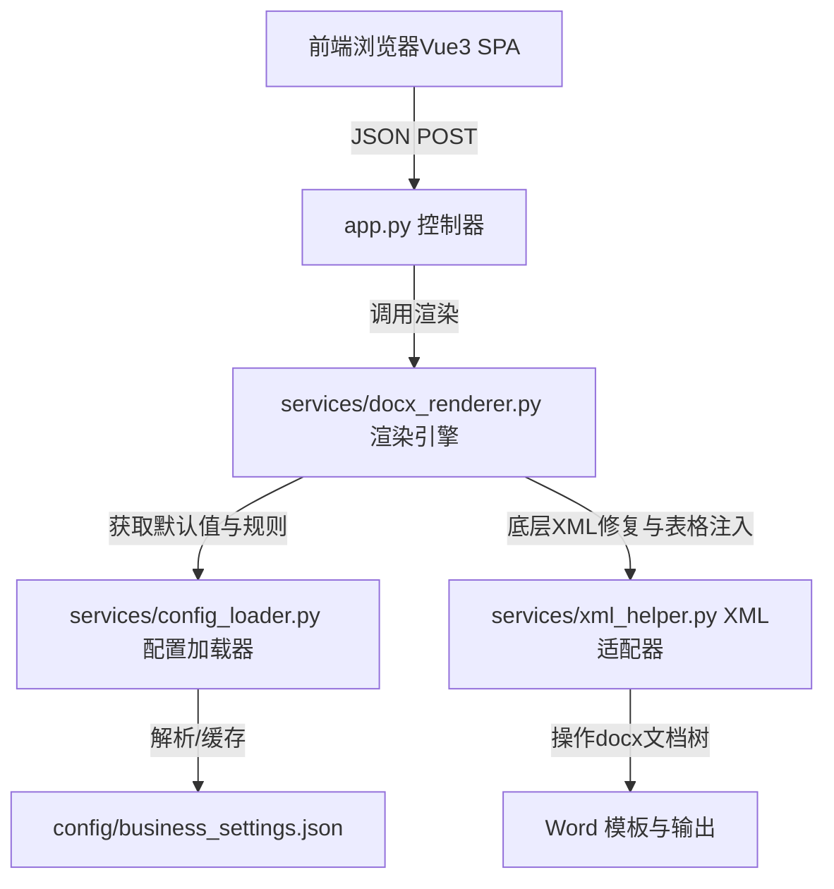

# 铁路通信设计辅助台 - 后续开发与维护指南

本指南旨在为后续接手本项目的开发人员提供详尽的系统架构说明、业务扩展流程、开发规范与常见问题排障 SOP。通过阅读本指南，您应该能够独立完成新增专业、新增房屋类型、修改默认配置、更新 Word 模板以及进行前端页面改造等任务。

---

## 1. 系统架构与技术栈

本工具台是一个用于中铁二院通信部门定制 Word 文档自动生成的单页 Web 应用（SPA），整体架构遵循“轻量级、无构建、易部署”的原则。

### 1.1 架构拓扑
- **前端（客户端）**：基于 **Vue 3 (CDN 引入)** + **Vue Router 4**。由于无构建步骤，所有组件均使用原生 ES Module (`.js` 文件) 编写，通过浏览器原生解析。
- **后端（服务层）**：基于 **Python 3.10+ / Flask 3.0+**。负责解析请求、合并业务配置、操作 Word 底层 XML 并通过 `docxtpl` 渲染最终的文档。
- **配置层**：**`config/business_settings.json`** 作为统一的业务数据源，支持房屋指标、电缆沟默认值、导入表格结构的集中式配置。
- **部署入口**：支持本地 Flask 服务直接运行，并配置有 `vercel.json` 以部署在 Vercel Serverless Function 平台。

### 1.2 核心模块职责分工



- **`app.py`**：应用网关。仅处理 HTTP 路由分发、静态资源兜底路由以及**业务化报错信息转换（`translate_error`）**。
- **`services/config_loader.py`**：配置中心。负责加载 `business_settings.json` 并维护一套完整的**降级硬编码默认值**，确保在配置文件缺失或损坏时，系统能降级运行而不崩溃。
- **`services/docx_renderer.py`**：生成逻辑。包含 QoS 审查卡片和互提资料的模板渲染流。自动合并前端传参和后端配置默认值、计算房屋排版序号、转换 RichText（软回车 `\a`）以保留多行文本格式。
- **`services/xml_helper.py`**：XML 净化与填充器。直接调用 `python-docx` 级别的 XML 节点操作。其核心逻辑有两个：
  1. 净化 Word 拼写检查产生的冗余标记（如 `w:proofErr`），还原被断开的 Jinja2 标签。
  2. 根据 Excel 导入的里程数据，定位 Word 模板中的特定“表格块”，并动态追加行与格式化输出。

---

## 2. 业务配置与扩展指南 (`business_settings.json`)

为了避免业务规则与代码逻辑强耦合，项目将所有房屋的默认面积、定员、用电量、电缆沟参数以及章节顺序抽取到了 [business_settings.json](file:///d:/code/y20_QoSGenerator/config/business_settings.json) 中。

### 2.1 配置文件核心字段解析
1. **`chapter_title_order`**：定义互提资料中 13 个专业章节在勾选时的**标准输出顺序与章节别名**。
2. **`chinese_section_numbers`**：预置的中文大写序号，用于重排章节。
3. **`room_orders`**：分别定义了房建 (`fj`)、电力 (`dl`)、机械 (`me`) 对应输出表格中，房屋的**标准排序先后顺序**。
4. **`room_defaults`**：19 种内置机房房屋的基准数据结构。包含：
   - `name`: 房屋名称
   - `area`: 默认面积 (平方米)
   - `staff`: 默认定员
   - `loc`: 默认设置位置
   - `power`: 默认用电量 (kW)
   - `power_level`: 默认供电等级
   - `voltage`: 默认供电电压
   - `power_remark`: 供电备注说明
5. **`cable_trench_defaults`**：电缆沟/电缆槽默认截面尺寸（宽、深）。
6. **`table_block_config`**：定义了可以从 Excel 导入的三个表格块（过轨里程表、引下位置表、分支引下槽表）的定位特征、表头、列对应关系。

### 2.2 实战演练：如何新增一种机房房屋类型？

假设现需要在房建和电力表格中增加一种新的房屋：**“通信中继站” (键名：`tx_relay`)**。

#### 步骤一：更新配置文件
打开 [business_settings.json](file:///d:/code/y20_QoSGenerator/config/business_settings.json)，修改以下三处：
1. **追加到排序数组**：在 `room_orders.fj` 和 `room_orders.dl` 数组的合适位置（例如末尾）追加字符串 `"tx_relay"`。
2. **添加默认值**：在 `room_defaults` 下新增对象：
   ```json
   "tx_relay": {
     "name": "通信中继站",
     "area": "40",
     "staff": "",
     "loc": "中继站场坪",
     "power": 10,
     "power_level": "一级",
     "voltage": "AC 380V±10%",
     "power_remark": "新增备注说明"
   }
   ```

#### 步骤二：更新前端 UI 表单与状态
1. 打开 [store.js](file:///d:/code/y20_QoSGenerator/static/js/store.js)，在 `MUTUAL_DATA_DEFAULT_ROOMS` 中补充 `tx_relay` 的默认启用状态：
   ```javascript
   tx_relay: { enabled: false, name: '通信中继站', area: '40', staff: '', loc: '中继站场坪', power: 10, power_level: '一级', voltage: 'AC 380V±10%', power_remark: '新增备注说明' }
   ```
2. 打开 [MutualDataGenerator.js](file:///d:/code/y20_QoSGenerator/static/js/views/MutualDataGenerator.js)，在房屋输入表单区域增加该房屋的交互控件。可通过 Vue 循环或静态布局渲染，确保其双向绑定到 `store.state.mutualDataForm.rooms.tx_relay`。

#### 步骤三：更新 Word 模板中对应的表格行
1. 打开 `templates_docx/htzl_yxtx_sgt.docx`（互提资料施工图模板）。
2. 在“向房建专业提资表”和“向电力专业提资表”中插入一行，编写以下 Jinja2 控制标签：
   - **房建表行控制**：
     `` 通信中继站 `|` `{{ area_tx_relay }}` `|` `{{ loc_tx_relay }}` `|` `{{ staff_tx_relay }}` `|` 序号绑定 `{{ idx_tx_relay }}` ``
   - **电力表行控制**：
     `` 通信中继站 `|` `{{ p_tx_relay }}` `|` `{{ h_tx_relay }}` `|` 供电参数 `|` 序号绑定 `{{ idx_el_tx_relay }}` ``
3. 检查并保存模板，重新进行测试。

---

## 3. Word 模板设计约束与排障 SOP

由于 Word 渲染基于 `docxtpl`（依托 Jinja2 语法解析 XML 树），模板语法有着极其严苛的格式约束。

### 3.1 核心语法约束（重要！）
在编辑 Word 模板时，必须严格区分段落标签与表格行标签。

> [!IMPORTANT]
> - **段落/章节控制**：如果需要控制整个段落、小节或普通文字的显示/隐藏，必须使用 **``** 和 **``**。此类标签必须单独成行，不与普通文字混杂在同一行，否则会导致段落样式丢失或报错。
> - **表格行控制**：如果需要控制表格中某一行的显示/隐藏（例如当某专业未勾选时隐藏表格中对应行），必须使用 **``** 和 **``**。此类标签必须分别放在该行首个单元格的开头和最后一个单元格的结尾。
> - **严禁混用**：在表格行内使用 `{%p if` 或在普通段落使用 `{%tr if` 会直接引发 `TemplateSyntaxError` 或生成损坏的 Word 文件。

### 3.2 标签被 Word 拼写检查断裂的问题（XML 截断）
#### 现象描述
在 Word 中录入 Jinja 标签（如 `{{ project_name }}`）时，Word 的自动拼写检查、语法纠错或格式自动调整经常会在后台将此标签拆分为多个 XML 节点。例如：
`{` + `{` + `project_name` + `}` + `}`
这会导致 Python 端的 Jinja2 引擎无法识别大括号，报错 `TemplateSyntaxError`。

#### 防治与修复 SOP
1. **预防方案**：在 Word 中录入标签时，尽量通过“无格式粘贴”一次性贴入，或者使用剪贴板一次性写完，避免在括号内部反复修改、回退。
2. **底层自动净化**：后端已集成 `xml_helper.py` 中的 `clean_xml_text` 逻辑，在渲染前会自动过滤常见的 Word 干扰标签（如 `<w:proofErr>` 拼写错误波浪线标记），无需人工介入。
3. **命令行修复工具**：如果遇到顽固的拆分报错，可以使用 [tools/fix/](file:///d:/code/y20_QoSGenerator/tools/fix/) 目录下的脚本：
   - 运行 `python tools/fix/fix_template_tags.py`：该脚本会自动解压指定的 `.docx` 文件，利用正则表达式修复被断开的标签，重新打包并替换原模板。

### 3.3 章节重排与自动编号规范
- **禁止使用 Python 代码强行重新编号**：通信提资文档包含大量的多级缩进、列表悬挂缩进和章节段落。如果在 Python 代码中用正则强行去修改段落文本的前缀（例如将段落前缀强制替换为“一、”、“二、”），将直接破坏 Word 的原生样式定义，导致文档内所有下属的子列表格式完全错乱。
- **推荐维护方案**：直接利用 Microsoft Word 自带的**“多级列表 - 自动编号”**功能。在 Word 模板中，设置标题 1 样式为自动编号（如 `一、`、`二、`）。当 `` 隐藏了某些不勾选的专业章节时，Word 在打开文档时会**自动动态重排**剩余的标题序号，天然保留完美的段落与悬挂缩进格式。

---

## 4. 前端开发规范 (Vue 3 CDN 单页应用)

为了方便非专业前端人员维护，前端采用无构建、轻量化的架构模式。

### 4.1 代码结构与开发规范
- **使用严格的组件化模式**：虽然没有 `.vue` 文件，但通过 ES6 的 `export default` 将组件定义在 `static/js/views/` 目录下。
- **样式规范**：统一在 `static/css/style.css` 中编写样式，禁止在组件中直接书写大量内联 `style`。
- **蓝图暗黑主题**：样式设计了以工程制图蓝图为灵感的高级暗黑科技感主题。使用 CSS 变量进行一致性设计（如 `--blueprint-bg`、`--blueprint-grid` 等）。
- **中文注释约束**：遵循全局规范，**前端 JS 文件的所有注释必须使用中文**。

### 4.2 路由与页面扩展流程
当需要增加一个全新的自动化生成功能页面时（如：**“无线通信提资卡”**）：
1. 在 `static/js/views/` 下新建组件文件 `WirelessGenerator.js`，导出 Vue 组件对象。
2. 打开 [router.js](file:///d:/code/y20_QoSGenerator/static/js/router.js)，导入新组件并添加路由规则：
   ```javascript
   { path: '/wireless', component: WirelessGenerator }
   ```
3. 打开 [Layout.js](file:///d:/code/y20_QoSGenerator/static/js/components/Layout.js)，在导航栏菜单中添加指向 `/wireless` 的链接按钮。

### 4.3 常用高级组件使用规范
1. **动态 SVG 电缆沟预览**：在 `MutualDataGenerator.js` 中有实时 SVG 渲染器。若以后修改了电缆沟的默认逻辑，需同步在 SVG 的 `<rect>` 和 `<path>` 属性中修改对应比例系数，确保图样与数值一致。
2. **QoS 常用意见片段抽屉**：位于 `QoSGenerator.js` 中。此抽屉的常用审查语定义在组件的 `snippets` 数组中。如果需要更新默认审查意见，直接在此数组中追加或修改中文词条即可。

---

## 5. 后端开发与重构规范

后端基于 Python 构建，代码要求严格分层且易于测试。

### 5.1 后端代码规范
- **严格遵守 Python PEP 8 规范**。
- **所有新增 Python 逻辑和注释必须使用中文**。
- **配置与逻辑分离**：禁止在 Python 代码中硬编码任何默认的业务参数（如面积、功率等），所有配置应存储在 `business_settings.json` 中。
- **业务化报错机制**：在 `app.py` 中，所有向前端抛出的 500 错误均需调用 `translate_error(error_msg)`。必须将底层的 Jinja2 解析异常、IO 读写异常转化为面向工程技术人员的友好中文提示，指导他们排查“是否模板格式写错”、“是否 Excel 格式不匹配”或“是否模板文件被 Word 独占打开”。

### 5.2 统一的异常捕获与翻译函数
当您需要添加新的业务报错拦截时，在 `app.py` 的 `translate_error` 函数中添加过滤条件：
```python
def translate_error(error_msg):
    # 示例：拦截特定异常
    if "SomeSpecificDatabaseError" in error_str:
        return "数据库访问异常，请检查配置。"
```

---

## 6. 测试与质量防线

项目内置了完整的单元测试与回归测试集，用于保障代码修改后旧功能不受影响。

### 6.1 现有测试文件说明
- [test_new_professions_template.py](file:///d:/code/y20_QoSGenerator/test_new_professions_template.py)：验证新增专业开关以及通用要求逻辑的最小渲染成功性。
- [test_station_front_table_blocks.py](file:///d:/code/y20_QoSGenerator/test_station_front_table_blocks.py)：验证从 Excel 导入数据并插入到 Word 对应三个表格块中的定位、匹配和行填充逻辑。
- [test_cross_data.py](file:///d:/code/y20_QoSGenerator/test_cross_data.py)：对互提资料整体输入数据进行全链路渲染回归测试。

### 6.2 运行回归测试
在对后端逻辑（尤其是 `services/` 目录）或业务配置文件进行任何修改后，必须运行以下命令确保 100% 通过：
```bash
# 在项目根目录下运行所有测试
python -m unittest discover -s . -p "test_*.py"
```
测试通过后，方可将代码提交或部署至生产环境。
